# ENTREGA ÚNICA · Reto 01

> Este documento reúne toda la información necesaria para exportar la entrega final a PDF.

---

## 1. Portada

# Proyecto de FHW · RA3 · UT5

## Reto 01
# Selección de ISOs Linux ligeras para HP Compaq dc7800

**Alumno/a:** Ugo Pérez Ruiz 
**Grupo:** 2 
**Curso:** 1º ASIR  
**Fecha:** 10/04/2026

## 2. Introducción

En este reto se plantea una situación parecida a la de un taller técnico real: antes de instalar un sistema en un equipo antiguo, conviene preparar varias opciones y comprobarlas.

El equipo objetivo es un **HP Compaq dc7800**, un ordenador veterano que puede presentar limitaciones de hardware. Por ello, en lugar de apostar por una sola distribución, se seleccionan varias **ISOs Linux ligeras** y se validan previamente en una **máquina virtual**.

La idea es parecida a llevar tres llaves para una cerradura vieja: puede que la primera abra a la primera, puede que otra se atasque, y puede que una tercera sea la que finalmente permita trabajar sin problemas. Por eso en este reto se eligen **tres candidatas**, se comparan y se prueban.

Los objetivos concretos son:

- analizar el hardware del equipo real;
- seleccionar tres distribuciones Linux razonables;
- justificar técnicamente cada elección;
- probar las tres en una VM;
- documentar resultados con capturas;
- decidir un orden de instalación para el aula taller.

## 3. Análisis del equipo real

# Datos del HP Compaq dc7800

## 1. Identificación del equipo
- **Marca y modelo:** HP Compaq DC7800SF
- **Número o variante del equipo (si aparece):**  
- **Ubicación o identificación en el aula:** 2 

## 2. Procesador
- **Modelo de CPU:** i2 E6750 
- **Número de núcleos (si se conoce):** 2 Núcleos 
- **Arquitectura observada o probable:** 64 bits 

## 3. Memoria RAM
- **Cantidad total instalada:** 1GB 
- **Tipo de memoria (si se conoce):** DDR2 

## 4. Almacenamiento
- **Tipo de unidad (HDD/SSD):** HDD 
- **Capacidad:** 250GB 
- **Observaciones:** Muy viejuno 

## 5. Arranque y firmware
- **¿Se ha observado BIOS o UEFI?:** BIOS 
- **Observaciones del menú de arranque:**   
- **Comentarios sobre el particionado previsto:**  

## 6. Puertos y conectividad
- **USB disponibles:** 6 directos de la placa 
- **Red:** RJ-45 
- **Otros datos relevantes:** Posee puertos PS2, conector VGA, conector en paralelo.

## 7. Valoración inicial
Es un equipo antiguo con poca memoria RAM (1GB), y un procesador con arquitectura de 64 bits, maneja BIOS por lo que usaremos MBR y no GPT. Tenemos bastantes conectores USB para conectar múltiples dispositivos al equipo, por lo que con el Linux adecuado, podríamos tener un equipo bastante decente para usuarios poco exigentes orientados a ofimática.

## 4. Selección de las 3 ISOs

### 4.1 Criterios usados
Explica con qué criterios habéis elegido las distribuciones.

### 4.2 Tabla comparativa
Copia o resume aquí la comparación entre las 3 ISOs.

### 4.3 Ficha resumida de ISO 01
- Distribución: Bodhi Linux
- Versión: bodhi-7.0.0-64
- Motivo de elección: He elegido esta ISO porque es un sistema operativo basado en Ubuntu, que aporta rendimiento, fiabilidad y facilidad de uso. Sus bajos requisitos mínimos y recomendados convierten a Bodhi Linux en una distribución ideal para el PC que tenemos en el taller.
- Papel dentro del plan: Respaldo

### 4.4 Ficha resumida de ISO 02
- Distribución: Sparky Linux
- Versión: 8.2 Xfce MinimalGUI amd64
- Motivo de elección: Es un sistema operativo que pide muy pocos requisitos, soporta arquitectura de 64 bits, y ocupa muy poco espacio.
- Papel dentro del plan: Alternativa

### 4.5 Ficha resumida de ISO 03
- Distribución: antiX Linux
- Versión: 23.1 "Arditi del Popolo"
- Motivo de elección: Al no llevar systemd consume poquísimos recursos y va a hacer que el equipo vuele. 
- Motivo de elección: Al estar basada en Debian estable, me da mucha tranquilidad y seguridad para su correcto funcionamiento del pc.
- Papel dentro del plan: Opción principal

## 5. Configuración de la máquina virtual

## Software utilizado
- **Aplicación:** VirtualBox 
- **Versión:** 7.2.2 r170484  

## Configuración aplicada
- **CPU:** 2 Núcleos  
- **RAM:** 1GB
- **Disco virtual:** 10GB  
- **Controlador de almacenamiento:** SATA 
- **Red:** NAT  
- **Audio / vídeo / otros ajustes relevantes:** 16MB VMSVGA, Audio ICH AC97  

## Relación con el equipo real
- He intentado simular el hardware del pc del taller, que tiene una CPU de 2 núcleos y 1GB de memoria RAM. 
- Lo que no puedo simular correctamente son los dispositivos de audio ni los de red, el resto es bastante cercano a lo que podríamos esperar.

## Observación importante
La máquina virtual sirve como **banco de pruebas previo**, pero no garantiza al 100 % el mismo comportamiento que el equipo real.
- Si se quiere instalar la versión completa del sistema operativo, debemos subir el espacio virtual del disco, esto se debe a que en la partición del /root se descargará el sistema operativo y todas sus aplicaciones, aunque podemos poner un disco más pequeño (5GB o el mínimo recomendado) y usar la versión live, que quizás se pueda hacer persistente.

## 6. Resultados de las pruebas

### 6.1 ISO 01
- ¿Arranca?: Sí.
- ¿Entra al instalador?: Sí.
- ¿Se instala? : Sí.
- ¿Arranca después? : Sí.
- Incidencias: Tiene una gestión de actualizaciones que no se actualiza con frecuencia y es un poco lenta al arrancar.
- Capturas:
- 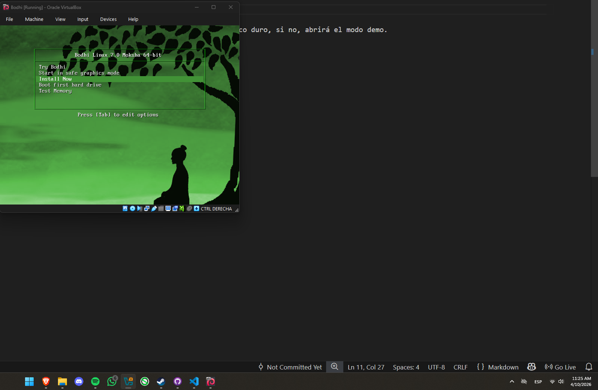
- 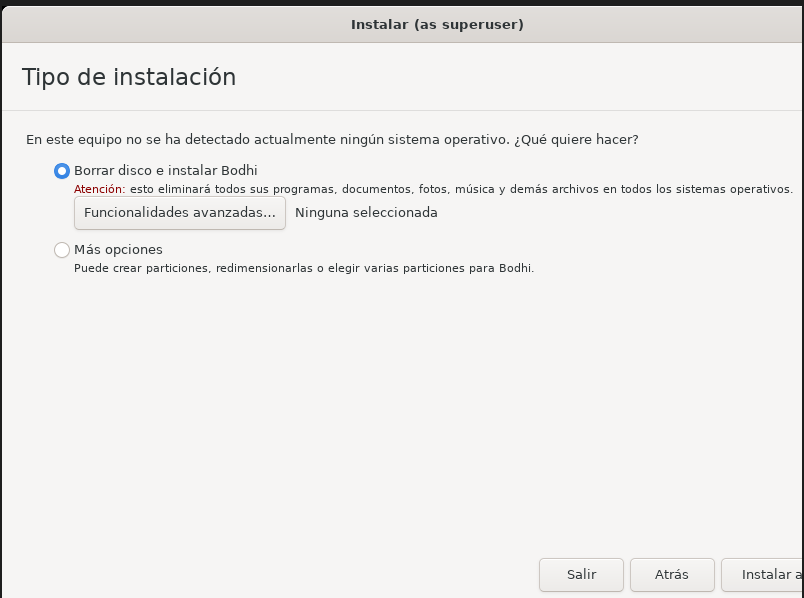
- 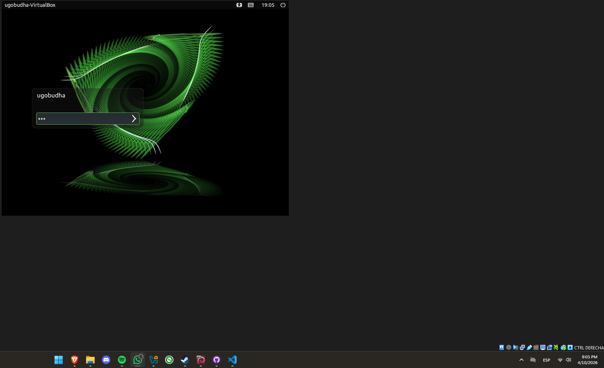
- 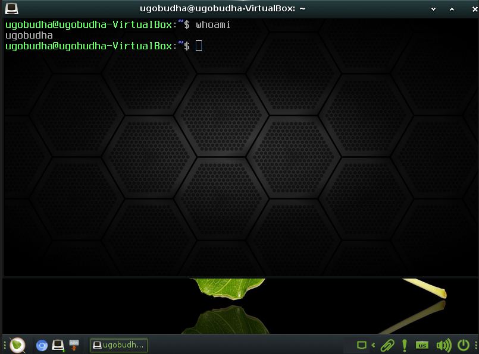

### 6.2 ISO 02
- ¿Arranca?: Sí.
- ¿Entra al instalador?: Sí.
- ¿Se instala?: Sí.
- ¿Arranca después?: Sí.
- Incidencias: Tuve que apagar el equipo porque se me quedó pillada en el arranque después del reinicio de la instalación.
- Capturas:
- 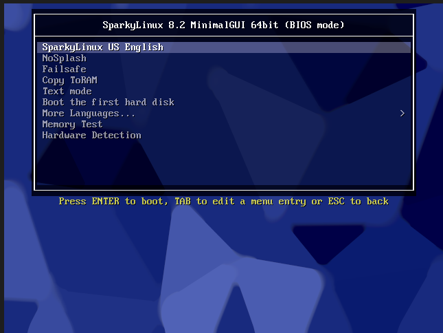
- 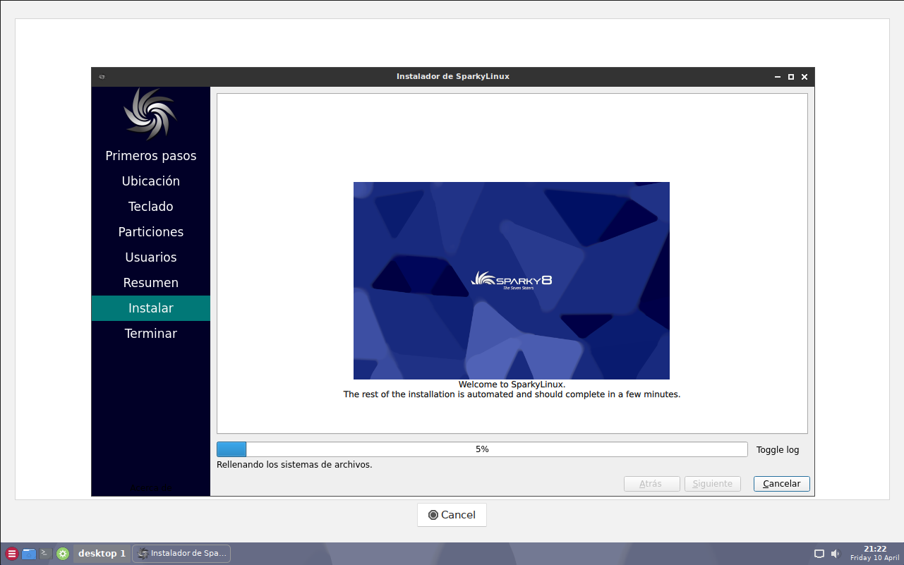
- 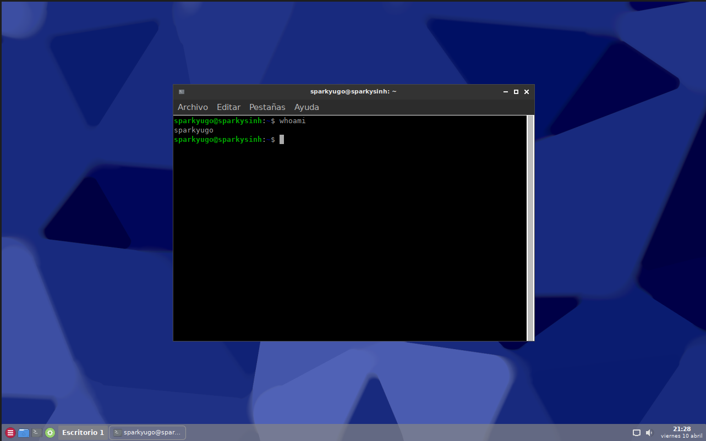

### 6.3 ISO 03
- ¿Arranca?: Sí.
- ¿Entra al instalador?: Sí.
- ¿Se instala?: Sí.
- ¿Arranca después?: Sí.
- Incidencias: Ninguna, ha ido todo perfecto.
- Capturas:
- 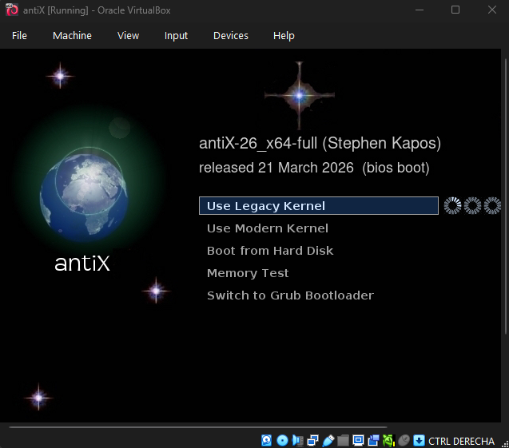
- 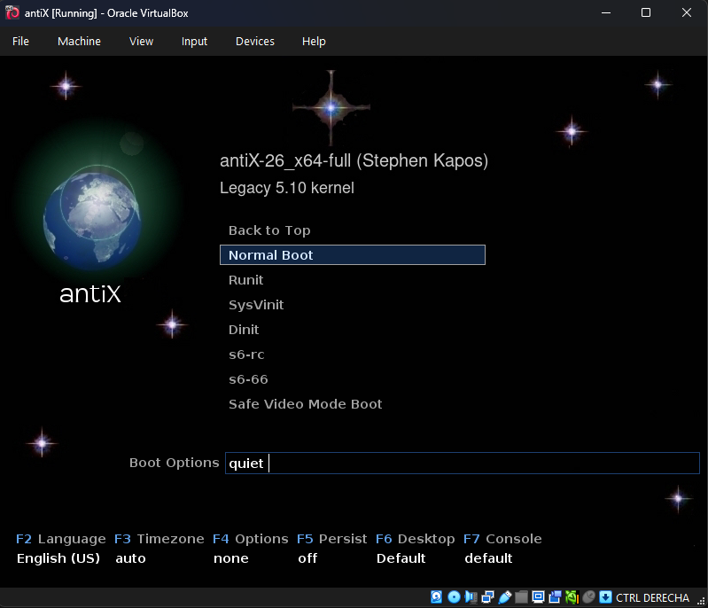
- 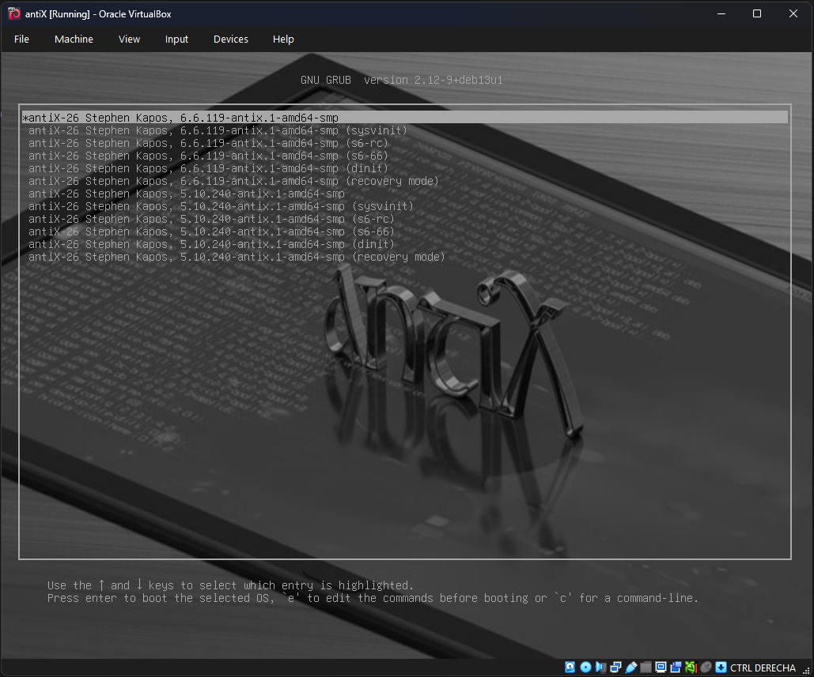
- 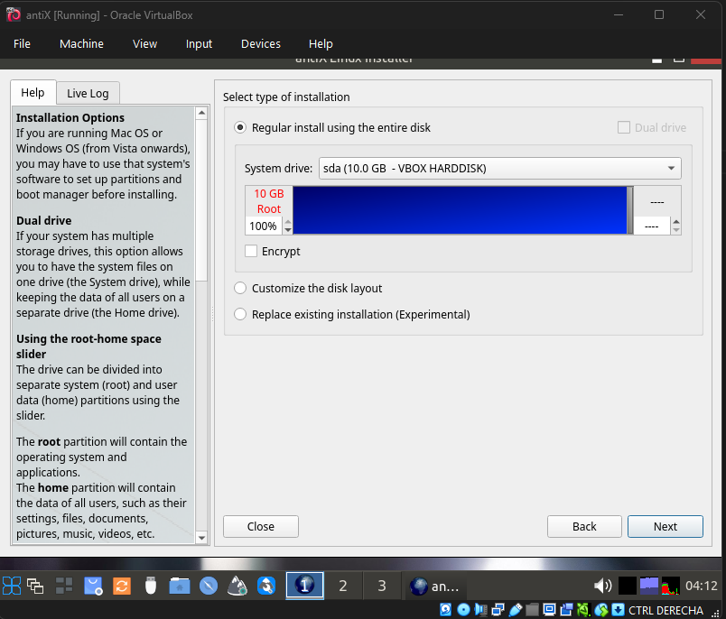
- 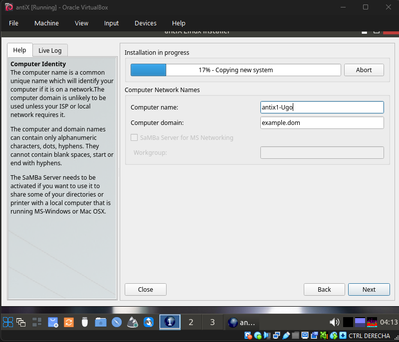
- 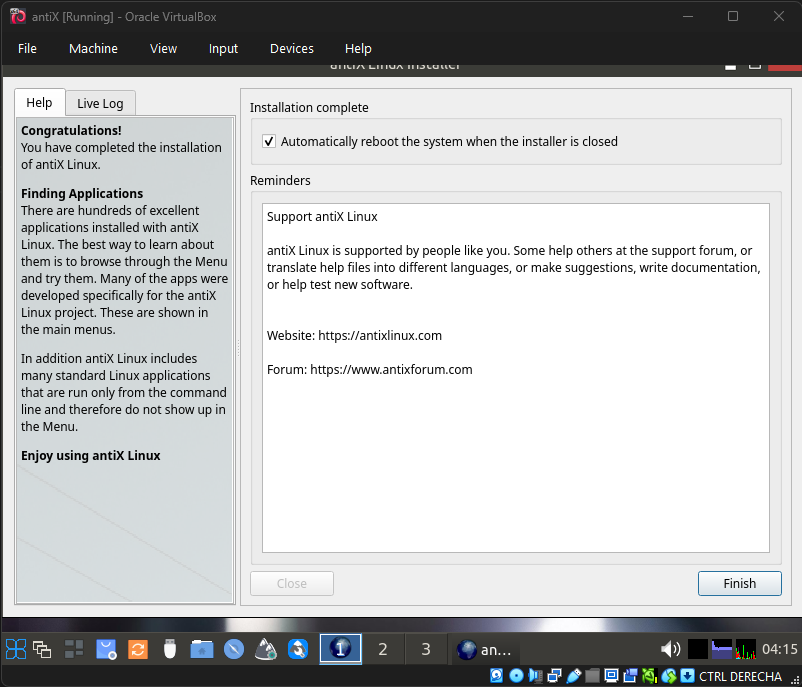
- 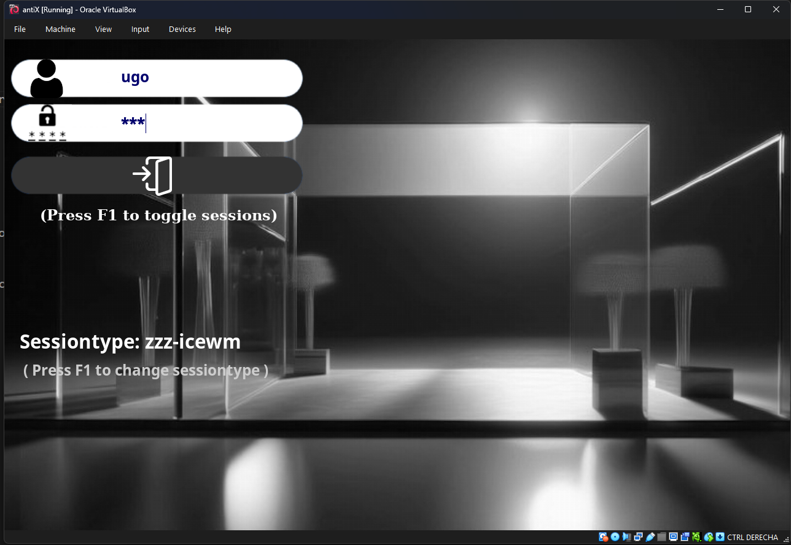
- 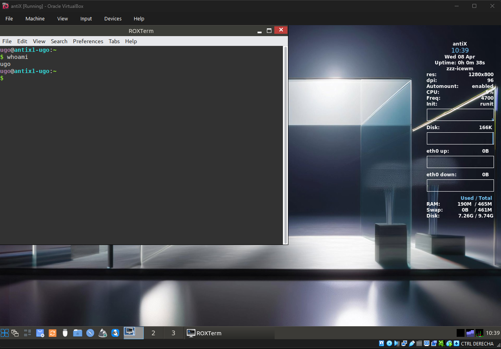

## 7. Conclusión final

- Sin duda alguna, como ISO principal dejaría antiX, es la que mejor ha ido, incluso con menos recursos y menos problemas ha dado, esta es mi opción principal. 

- Como ISO alternativa dejo Sparky Linux, la pongo como una mejor opción que Bodhi Linux porque es más rápida, pero en cuanto a recursos y funcionamiento en reposo, ambas están muy parejas. 

- Como ISO de respaldo dejo Bodhi Linux, es bonita, funciona bien, pero al inicio es muy lenta.

## 8. Bibliografía

- Bodhi Linux:
- https://sourceforge.net/projects/bodhilinux/files/7.0.0/bodhi-7.0.0-64.iso/download  
- https://www.bodhilinux.com/ 

- Sparky Linux:
- https://sourceforge.net/projects/sparkylinux/files/base/sparkylinux-8.2-x86_64-minimalgui.iso/download
- https://sparkylinux.org/about/

- antiX:
- https://sourceforge.net/projects/antix-linux/files/Final/antiX-26/antiX-26_x64-full.iso/download
- https://antixlinux.com/
- https://debian-beginners-handbook.arpinux.org/trixie-en/index.html
