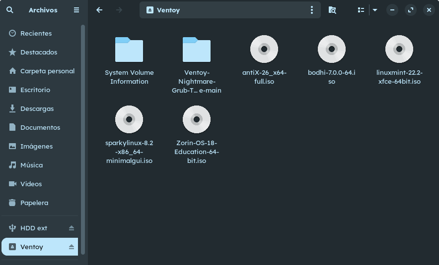

# Ficha · Relación de ISOs copiadas en el USB

## ISO 01
- Distribución: Puppy Linux
- Versión: Bookworm 10.0.12 
- Nombre del archivo ISO: BookwormPup64_10.0.12.iso
- Papel previsto: Principal 

## ISO 02
- Distribución:
- Versión:
- Nombre del archivo ISO:
- Papel previsto: principal / alternativa / respaldo

## ISO 03
- Distribución:
- Versión:
- Nombre del archivo ISO:
- Papel previsto: principal / alternativa / respaldo

## Evidencias
- Captura del explorador mostrando las 3 ISOs copiadas:
    - 
- Captura del menú de Ventoy donde aparezcan las 3 ISOs:
    - 