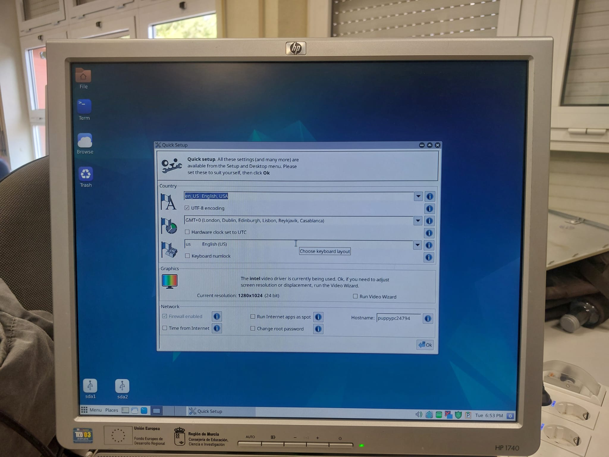

# Ficha · Intento de instalación 1

## 1. Datos básicos
- ISO utilizada: Puppy Linux
- Fecha y hora aproximada: 17/04/2026 a las 20:05-20:55
- Puesto dentro del plan: Alternativa

## 2. Arranque
- ¿Se seleccionó la ISO desde Ventoy?
  - Sí.
- ¿La ISO arrancó correctamente?
  - Arrancó a la primera sin problemas.
- Evidencia:
  
  
## 3. Instalación
- ¿Se llegó al instalador?
  - Sí.
- Tipo de instalación elegido:
  - Instalación manual, con particiones manuales.

- Esquema de particionado usado:
  - Partición raíz ext4 + Partición boot FAT32
  
- Pasos principales realizados(TODOS LOS RELEVANTES):
  1. Abrir el instalador rápido.
  2. Elegir el país, servidor ntp (para la hora).
  3. Controladores de vídeo.
  4. Particionado del sistema.
  5. Instalación del sistema.

## 4. Resultado del intento
- ¿La instalación finalizó correctamente?
  - Sí.
- ¿El sistema arrancó después?
  - Sí.
- Estado final: éxito

## 5. Problemas encontrados
- Problema 1: El principal problema era conseguir que el equipo arrancase con Ventoy.
- Problema 2: Como problema menor añadiría que la instalación tiene que ser obligatoriamente manual, incluyendo el particionado manual del sistema,            haciéndolo algo más difícil de instalar para gente menos experimentada.

## 6. Soluciones aplicadas
- Solución 1: Cambiar el orden de arranque múltiples veces, ser pacientes y seguir intentando arrancar.
- Solución 2: Aplicar nuestros conocimientos de sistemas para hacer el particionado del sistema.

## 7. Decisión tomada
- Continuamos con la siguiente ISO puesto que Puppy no era nuestra opción principal.

## 8. Evidencias
- Captura de arranque: 
- Captura del instalador:
- Captura del resultado final o del error:
  
  
  
  
  