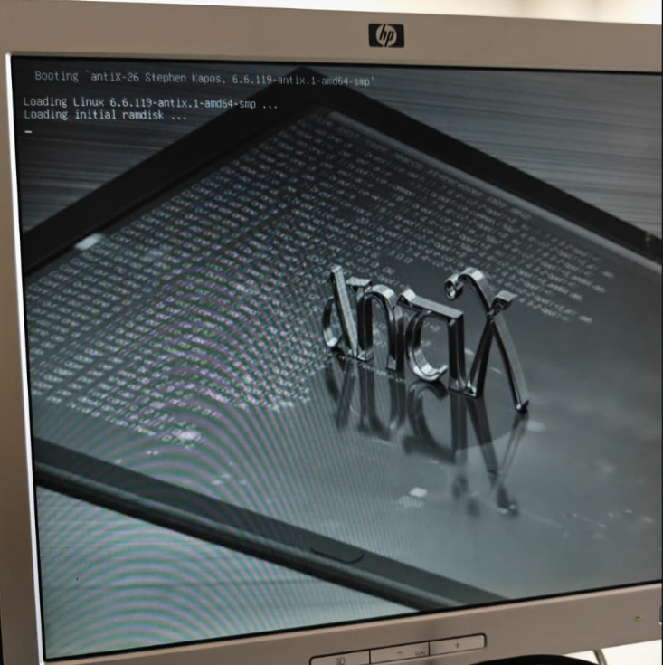

# Ficha · Intento de instalación 2

## 1. Datos básicos
- ISO utilizada: antiX
- Fecha y hora aproximada: 21/04/2026 a las 16:50.
- Puesto dentro del plan: Principal

## 2. Arranque
- ¿Se seleccionó la ISO desde Ventoy?
 - No, tuvimos que usar Rufus.
- ¿La ISO arrancó correctamente?
  - Desde Rufus, la ISO arrancó sin ningún problema.
- Evidencia:
 

## 3. Instalación
- ¿Se llegó al instalador?
  - Sí.
- Tipo de instalación elegido:
  - Instalación automática.
- Esquema de particionado usado:
  - Predeterminado sugerido por antiX. Raíz ext4 + swap swap
- Pasos principales realizados:
  1. Iniciar el sistema.
  2. Iniciar el instalador.
  3. Elegir el tipo de instalación.
  4. Confirmar y reiniciar el equipo booteando desde el disco duro.

## 4. Resultado del intento
- ¿La instalación finalizó correctamente?
  - Sí.
- ¿El sistema arrancó después?
  - Sí.
- Estado final: éxito 

## 5. Problemas encontrados
- Problema 1: Tuvimos que usar Rufus, nuestro equipo del taller no cargaba el USB con Ventoy, probablemente fuera cosa de la memoria RAM.

## 6. Soluciones aplicadas
- Solución 1: Utilizar un USB con Rufus para poder bootear el sistema.

## 7. Decisión tomada
- En nuestro equipo del taller esta es la ISO que dejamos, funcionaba extremadamente bien, sin congelamientos, tirones, ni errores inesperados.

## 8. Evidencias
- Captura de arranque:
 
- Captura del instalador:

- Captura del resultado final o del error:
