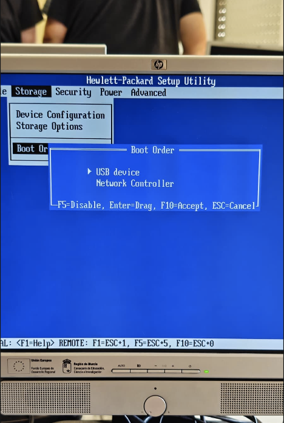
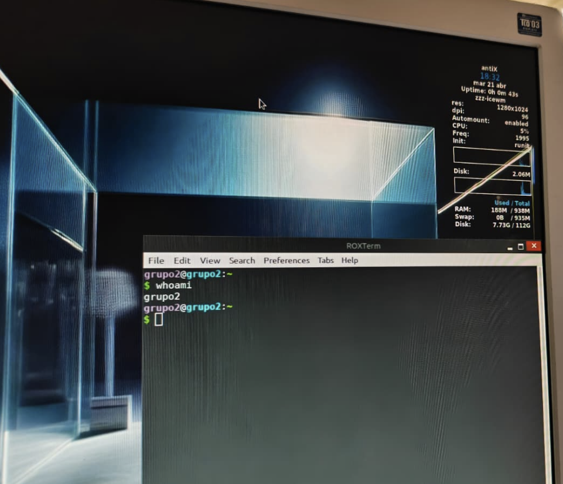

# Ficha · Registro general de la instalación

## 1. Datos de la sesión de trabajo
- Fecha: 17/04/2026-21/04/2026
- Aula o taller: Taller
- Miembros del grupo: Tahoe, Natalia, Valentín, Ugo.
- Equipo utilizado: HP Compaq dc7800

## 2. Preparación previa
- ¿El USB con Ventoy estaba listo?
    - Sí.
- ¿Estaban copiadas las 3 ISOs?
    - Sí.
- ¿Se sabía el orden de intento?
    - Sí.

## 3. Arranque del equipo
- Tecla o método usado para seleccionar el arranque:
    - F10.
- ¿Entró correctamente en el menú de arranque?
    - Sí.
- ¿Se detectó el USB?
    - Sí.
- ¿Ventoy arrancó correctamente?
    - El primer día en el taller sí, el segundo día no.

## 4. Resultado global
- ISO finalmente instalada: antiX.
- ¿La instalación terminó correctamente? Sí.
- ¿El sistema arranca después de instalar? Sí.
- Observaciones generales: El sistema funciona de forma muy fluida.

## 5. Evidencias clave
- Foto o captura del menú de arranque:

- Foto o captura del menú de Ventoy:

- Foto o captura del sistema ya instalado:

