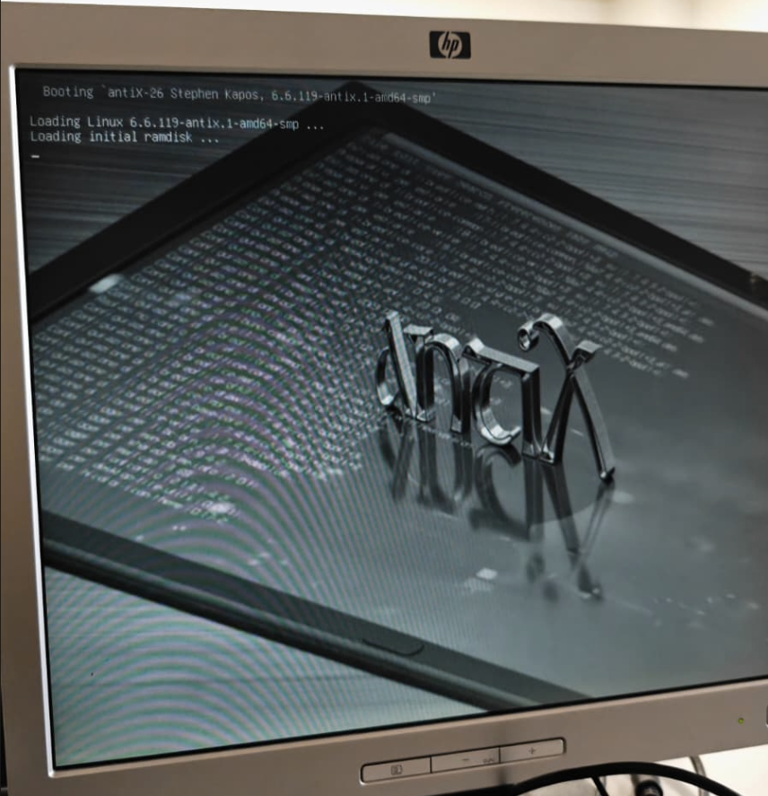
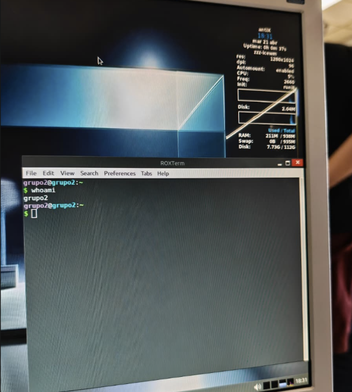
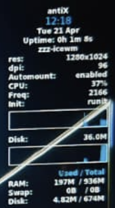

# Sistema instalado · Evidencia final

## Distribución finalmente instalada
- Nombre: antiX
- Versión: antiX-26_x64-full
- Entorno de escritorio: IceWM
- Arquitectura: 64 bits

## Evidencias obligatorias
- Foto o captura de la pantalla de inicio de sesión:
    - 
- Foto o captura del escritorio o entorno ya iniciado:
    - 
- Foto o captura de información básica del sistema:
    - 

## Estado del equipo al finalizar
- ¿Arranca sin el USB?
    - Sí, arranca sin problemas.
- ¿Se ve estable el sistema?
    - No hemos realizado pruebas de estrés, pero estuvimos testeando algunas aplicaciones gráficas una vez instalado, crear ficheros de texto vía terminal y todo funcionó sin tirones, congelamientos ni problemas.
- ¿Hubo que reiniciar varias veces?
    - No, nada más terminó la instalación, hicimos el reinicio requerido para arrancar desde el disco y funcionó a la primera.
- Observaciones:
    - No hay ninguna observación negativa del procedimiento ni el sistema, todo funcionó como se esperaba.

## Valoración final de la instalación
Explica brevemente por qué consideras que la instalación ha quedado realizada correctamente.

- El sistema pudo arrancar perfectamente desde el disco donde instalamos el sistema
- El uso que le dimos al sistema instalado nos dio una muy buena sensación de estabilidad y fluidez a pesar de los limitados recursos del equipo.
- Facilidad y velocidad de instalación.

- Teniendo en cuenta todas estas cosas, considero que la instalación fue todo un éxito y que el sistema trabaja como esperábamos desde un principio.