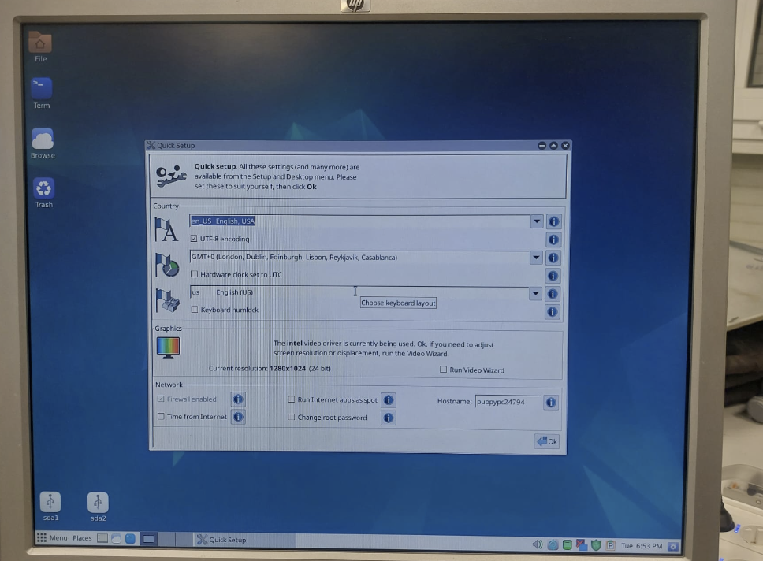
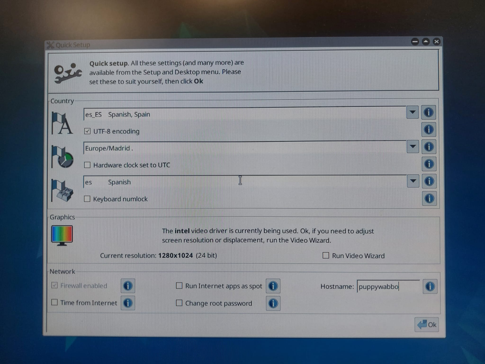
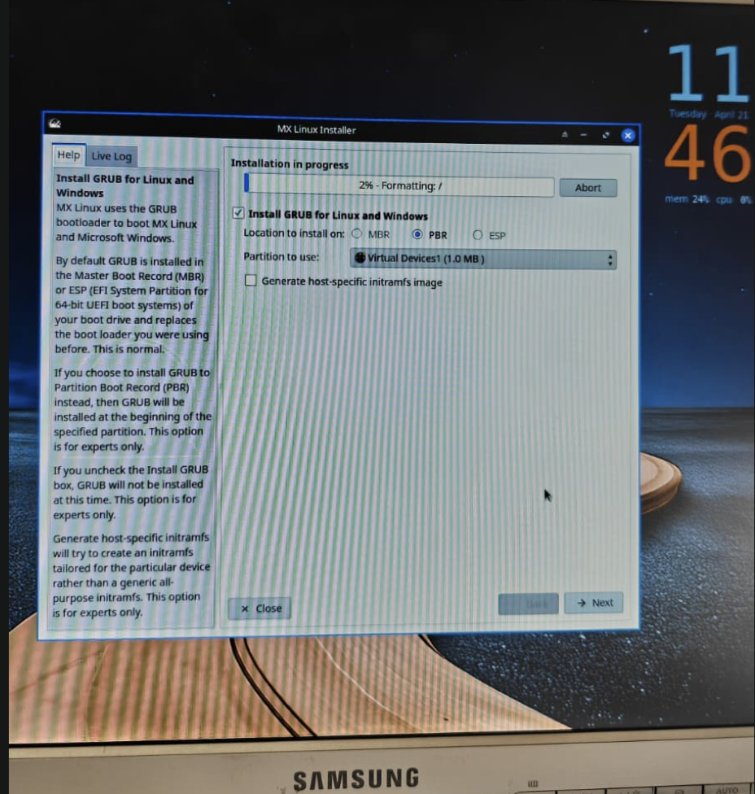
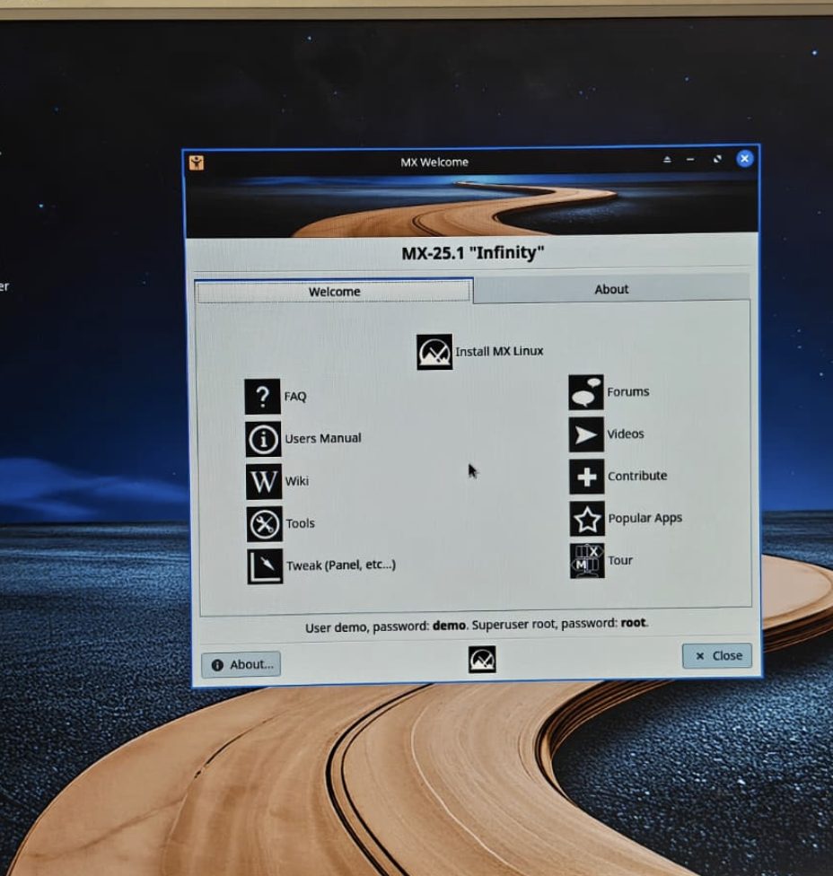

# ENTREGA ÚNICA · Reto 02

> Este documento reúne toda la información necesaria para exportar la entrega final a PDF.

---

## 1. Portada

# Proyecto de FHW · RA3 · UT5

## Reto 02
# Instalación de Linux en HP Compaq dc7800 mediante Ventoy

**Alumno/a:** Ugo Pérez Ruiz 
**Grupo:** 2 
**Curso:** 1º ASIR 
**Fecha:** 21/04/2026 

---

## 2. Introducción

En este reto el objetivo es pasar de la preparación previa a la **instalación real** de una distribución Linux en el **HP Compaq dc7800**.

En el reto anterior se eligieron tres distribuciones y se probaron en una máquina virtual.  
Ahora toca trabajar con el equipo físico, utilizando **Ventoy** como medio de arranque para tener disponibles las tres ISOs en un único USB.

La idea es sencilla: llevar al aula taller una especie de **mochila técnica**.  
Si la primera ISO falla, ya tenemos una segunda y una tercera preparadas, sin tener que rehacer el USB desde cero.

Este documento debe dejar constancia de:
- cómo se preparó el USB con Ventoy,
- qué tres ISOs se copiaron,
- en qué orden se intentó la instalación,
- qué problemas aparecieron,
- qué soluciones se aplicaron,
- y qué sistema quedó finalmente instalado.

## 3. Preparación del USB con Ventoy

### 3.1 Datos del pendrive

- Marca y modelo: SanDisk Ultra USB 3.0 
- Capacidad: 128GB

### 3.2 Preparación de Ventoy

Pasos seguidos para instalar Ventoy en el USB:
  1. Instalar Ventoy desde CurseForge.
  2. Abrir el ejecutable.
  3. Formatear el USB desde Ventoy.
  4. Arrastrar las ISOs descargadas en el USB formateado con Ventoy.

### 3.3 Relación de ISOs en el USB

- ISO 01: Puppy Linux
- ISO 02: antiX
- ISO 03: MX Linux

### 3.4 Evidencias
- Captura del contenido del USB:
    - 
- Captura del menú de Ventoy:
    - 

## 4. Plan de instalación

### 4.1 Orden previsto de intento
1. **Primera opción:** Puppy Linux
   - Motivo: Era la primera opción que teníamos en el menú de arranque y una de las opciones más ligeras de todas.
2. **Segunda opción:** antiX
   - Motivo: Fue la segunda opción del menú de arranque, y fue la que finalmente instalamos en nuestro equipo.
3. **Tercera opción:** MX Linux
   - Motivo: Fue la última opción del menú de arranque, que, aunque la instalamos en otro equipo, fue la última opción.

### 4.2 Criterios para cambiar de ISO

- Cuando terminamos de instalar una ISO pasamos a la siguiente para comprobar el funcionamiento de todas.
- Empezamos instalando Puppy Linux, seguimos con antiX (con Rufus) y MX Linux en un equipo diferente del taller.

## 5. Desarrollo de la instalación en el HP Compaq dc7800

### 5.1 Arranque desde USB
- Método o tecla usada: F10.
- ¿Se detectó correctamente el USB? Sí.
- ¿Ventoy arrancó? El primer día (17/04/2026) arrancaba correctamente, pero el segundo día (21/04/2026) no.

### 5.2 Intento con ISO 01
- ¿Arrancó?
    - Sí.
- ¿Entró al instalador?
    - Sí.
- ¿Terminó la instalación? 
    - Sí.
- ¿Hubo que cambiar de ISO?
    - No necesariamente, pero la cambiamos porque no era nuestra opción principal.
- Problemas:
    - El principal problema era conseguir que el equipo arrancase con Ventoy.
    - Como problema menor añadiría que la instalación tiene que ser obligatoriamente manual, incluyendo el particionado manual del sistema,            haciéndolo algo más difícil de instalar para gente menos experimentada.
- Soluciones:
    - Cambiar el orden de arranque múltiples veces, ser pacientes y seguir intentando arrancar.
    - Aplicar nuestros conocimientos de sistemas para hacer el particionado del sistema.
- Capturas:
  
  
  

### 5.3 Intento con ISO 02
- ¿Arrancó?
    - Sí.
- ¿Entró al instalador?
    - Sí.
- ¿Terminó la instalación? 
    - Sí.
- ¿Hubo que cambiar de ISO?
    - No la cambiamos en nuestro equipo asignado del taller.
- Problemas:
    - Tuvimos que usar Rufus, nuestro equipo del taller no cargaba el USB con Ventoy, probablemente fuera cosa de la memoria RAM.
- Soluciones:
    - Utilizar un USB con Rufus para poder bootear el sistema.
- Capturas:
 
 
 

### 5.4 Intento con ISO 03
- ¿Arrancó?
    - Sí.
- ¿Entró al instalador?
    - Sí.
- ¿Terminó la instalación?
    - Sí.
- ¿Hubo que cambiar de ISO?
    - No necesariamente, fue la última ISO que probamos.
- Problemas: 
    - Tuvimos que usar otro equipo del taller porque nuestro equipo inicial no conseguía cargar el gestor de arranque de Ventoy.
- Soluciones:
    - Buscar otro equipo con una mayor memoria RAM.
- Capturas:

## 6. Sistema finalmente instalado

- Distribución: antiX
- Versión: antiX-26_x64-full
- ¿Arranca sin el USB? Sí.
- Evidencias del sistema instalado:  

## 7. Problemas encontrados y soluciones aplicadas

- Nuestro equipo principal dejó de poder arrancar el menú de Ventoy, por lo que tuvimos que pedir otro equipo diferente del taller.

- Mientras unos compañeros del grupo se encargaban de instalar y probar los otros sistemas en el nuevo equipo, el resto de compañeros estuvieron intentando resucitar el equipo antiguo para conseguir instalar antiX, estuvieron quitando la CMOS, cambiando la RAM, y tras no conseguir nada nuevo, cambiaron el USB de Ventoy por uno de Rufus, consiguiendo así instalar antiX sin problemas.

## 8. Conclusión final

- Al final dejamos instalado en nuestro equipo inicial antiX. En este trabajo hemos aprendido a usar escritorios Live, a detectar errores de equipos antiguos, buscar posibles soluciones y revivir algunos equipos. También aprendimos que no siempre lo más nuevo y completo es siempre lo mejor, a veces el software Legacy sigue siendo la mejor opción en equipos antiguos.  

## 9. Bibliografía

## Fuentes utilizadas
- No utilizamos ninguna fuente de información, todo fue fruto de lo que aprendimos en retos anteriores y en las clases de FHW.
